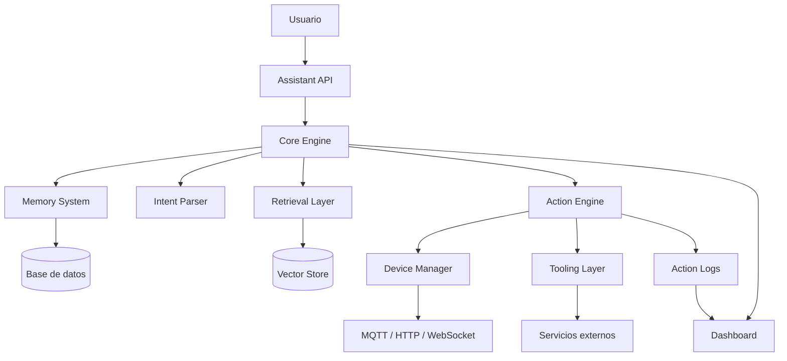
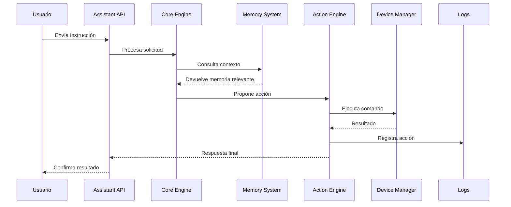
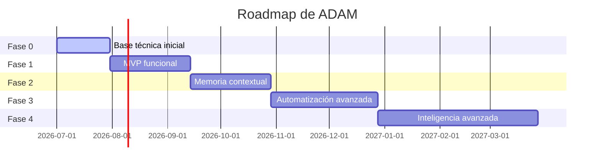

<div align="center">

# The ADAM project

### Asistente inteligente modular para memoria, automatización, acciones y control técnico

<p>
  
  
  
</p>

<p>
  
</p>

<p>
  
  
  
  
  
  
</p>

</div>

---

## Descripción general

**ADAM** es un proyecto de asistente inteligente modular diseñado para integrar razonamiento, memoria persistente, automatización, ejecución de acciones y control de dispositivos físicos o digitales.

El proyecto inició como una idea experimental de asistente avanzado y actualmente se encuentra en una fase temprana de desarrollo, con algunos módulos trabajados a nivel de código y una arquitectura pensada para crecer progresivamente.

ADAM no debe entenderse todavía como un producto terminado, sino como una base técnica en evolución para construir un asistente capaz de **recordar, interpretar, ejecutar y aprender de forma autónoma y controlada**.

---

## Estado actual

| Área | Estado |
|---|---|
| Núcleo conceptual | Definido |
| Módulos base | En desarrollo |
| Código existente | Parcial |
| Dashboard | En desarrollo / planificado |
| Memoria persistente | Diseño definido |
| Domótica / dispositivos | En fase inicial |
| IA avanzada | Roadmap futuro |
| Online learning | No implementado todavía |
| LoRA / adapters | Futuro |
| World model | Futuro |
| Producción enterprise | No aplica todavía |

---

## Objetivo del proyecto

El objetivo principal de ADAM es construir un ecosistema modular capaz de:

- Interpretar instrucciones del usuario.
- Consultar memoria y contexto previo.
- Ejecutar acciones controladas.
- Gestionar dispositivos o servicios externos.
- Registrar interacciones y resultados.
- Servir como base para un asistente más avanzado, privado y extensible.

La idea central es que ADAM no sea solo un chatbot, sino un sistema capaz de **razonar, recordar y actuar** dentro de un entorno técnico controlado.

---

## Visión general

ADAM busca convertirse en un asistente inteligente **local-first**, modular y extensible, capaz de operar en entornos como:

- Hogares inteligentes.
- Oficinas.
- Laboratorios.
- Proyectos de automatización.
- Sistemas domóticos.
- Entornos educativos o experimentales.
- Plataformas personales de productividad técnica.

La visión futura incluye memoria viva, ejecución de herramientas, integración con dispositivos, aprendizaje incremental y verificación antes de ejecutar acciones críticas.

---

## Qué es ADAM

ADAM es:

- Un asistente modular.
- Un núcleo de automatización inteligente.
- Una plataforma para conectar memoria, acciones y dispositivos.
- Un proyecto experimental con visión de largo plazo.
- Una base para construir un sistema tipo asistente técnico local.

---

## Qué no es ADAM actualmente

ADAM todavía no es:

- Un asistente completamente autónomo.
- Un modelo de lenguaje propio entrenado desde cero.
- Un sistema de aprendizaje en tiempo real terminado.
- Un producto comercial listo para producción.
- Una alternativa completa a asistentes como Alexa, Google Assistant o ChatGPT.

La mayoría de funciones avanzadas forman parte del roadmap futuro, no del estado actual del sistema.

---

## Principios de diseño

| Principio | Descripción |
|---|---|
| Modularidad | Cada parte del sistema debe poder desarrollarse, probarse y reemplazarse de forma independiente. |
| Escalabilidad progresiva | El sistema debe iniciar simple y crecer por fases, evitando sobrecargar el MVP. |
| Memoria persistente | ADAM debe poder registrar interacciones, acciones y preferencias para mejorar el contexto. |
| Acciones verificables | Antes de ejecutar acciones importantes, el sistema debe validar intención, contexto y permisos. |
| Local-first | Siempre que sea posible, ADAM debe poder ejecutarse de forma local para proteger privacidad. |
| Extensibilidad | El sistema debe permitir agregar nuevos módulos, herramientas, dispositivos o servicios sin rehacer toda la arquitectura. |

---

## Arquitectura general propuesta



---

## Módulos principales

### 1. Core Engine

El **Core Engine** es el núcleo lógico de ADAM.

Su función es recibir solicitudes, interpretar intención, consultar contexto, decidir qué módulo debe intervenir y coordinar la respuesta o acción.

Responsabilidades:

- Procesar entradas del usuario.
- Identificar intención.
- Consultar memoria.
- Crear un plan básico.
- Coordinar acciones.
- Devolver respuesta o ejecutar comandos.

Estado actual:

- En desarrollo.
- Pensado como el centro lógico del sistema.

---

### 2. Memory System

El sistema de memoria permite que ADAM conserve información útil para futuras interacciones.

Tipos de memoria previstos:

#### Memoria episódica

Registra eventos concretos:

- Interacciones.
- Comandos ejecutados.
- Fechas.
- Resultados.
- Errores.
- Confirmaciones del usuario.

#### Memoria semántica

Guarda conocimiento útil para recuperación contextual:

- Documentos.
- Fragmentos de conversación.
- Manuales.
- Configuraciones.
- Información técnica.

#### Memoria de preferencias

Guarda datos simples sobre comportamiento esperado:

- Preferencias del usuario.
- Nombres personalizados.
- Reglas básicas.
- Configuraciones recurrentes.

Estado actual:

- Diseño conceptual definido.
- Implementación inicial o parcial según los módulos existentes.

---

### 3. Device Manager

El **Device Manager** se encarga de registrar, monitorear y controlar dispositivos.

Puede usarse para:

- Domótica.
- Sensores.
- Actuadores.
- Luces.
- Relés.
- Dispositivos IoT.
- Servicios conectados.

Responsabilidades:

- Registrar dispositivos.
- Consultar estado.
- Actualizar disponibilidad.
- Enviar comandos.
- Detectar errores o desconexiones.

Protocolos considerados:

- MQTT.
- HTTP.
- WebSocket.
- API REST.
- CLI.

Estado actual:

- Módulo prioritario para una primera versión funcional.

---

### 4. Action Engine

El **Action Engine** ejecuta acciones concretas.

Ejemplos de acciones:

- Encender o apagar un dispositivo.
- Cambiar un estado.
- Crear un registro.
- Ejecutar una tarea local.
- Consultar una API.
- Enviar una instrucción a otro módulo.

Responsabilidades:

- Recibir instrucciones estructuradas.
- Validar permisos.
- Ejecutar acciones.
- Registrar resultados.
- Bloquear acciones inseguras.

Estado actual:

- Módulo clave para convertir ADAM en un sistema accionable.

---

### 5. Retrieval Layer

El **Retrieval Layer** permite buscar información relevante antes de responder o actuar.

Su objetivo es evitar que ADAM dependa únicamente del modelo de lenguaje o de reglas estáticas.

Funciones previstas:

- Generar embeddings.
- Buscar información relacionada.
- Recuperar contexto.
- Entregar evidencia al Core Engine.

Tecnologías consideradas:

- FAISS.
- Milvus.
- SentenceTransformers.
- Postgres.
- Vector search.

Estado actual:

- Propuesto para fases posteriores al núcleo inicial.

---

### 6. Dashboard

El dashboard será la interfaz visual para observar y administrar ADAM.

Funciones previstas:

- Ver estado general del sistema.
- Ver dispositivos conectados.
- Revisar historial de acciones.
- Consultar errores.
- Visualizar logs.
- Administrar configuración básica.

Tecnologías consideradas:

- FastAPI.
- React.
- Vue.
- Grafana.
- REST API.

Estado actual:

- Recomendado como parte del MVP para validar funcionamiento real.

---

### 7. World Model

El **World Model** será una representación interna del estado del entorno.

Puede incluir:

- Dispositivos.
- Ubicaciones.
- Relaciones.
- Reglas.
- Estados actuales.
- Restricciones.

Ejemplo:

```json
{
  "room": "living_room",
  "devices": ["light_001", "sensor_temp_001"],
  "rules": [
    "do_not_turn_on_light_after_midnight_without_confirmation"
  ]
}
```

Estado actual:

- Concepto futuro.
- No necesario para la primera versión.

---

### 8. Online Learning

El aprendizaje en línea permitiría que ADAM mejore a partir de interacciones reales.

Sin embargo, esta función requiere control estricto porque puede introducir errores o comportamientos no deseados.

Componentes futuros:

- Selección de ejemplos.
- Entrenamiento de adapters.
- Validación humana.
- Pruebas de regresión.
- Despliegue controlado.

Estado actual:

- Fase futura.
- No debe formar parte del MVP inicial.

---

### 9. Neurosymbolic Reasoner

Este módulo combinaría razonamiento basado en IA con reglas simbólicas.

Uso previsto:

- Validar acciones críticas.
- Aplicar restricciones.
- Evitar contradicciones.
- Mejorar seguridad.
- Reducir respuestas incorrectas.

Tecnologías consideradas:

- Z3.
- pyDatalog.
- Reglas personalizadas.
- Planificadores simbólicos.

Estado actual:

- Fase avanzada futura.

---

## MVP recomendado

La primera versión funcional de ADAM debe ser pequeña, clara y ejecutable.

### Objetivo del MVP

Construir una versión donde ADAM pueda:

1. Recibir una instrucción.
2. Interpretar intención básica.
3. Consultar memoria simple.
4. Identificar una acción.
5. Solicitar confirmación si es necesario.
6. Ejecutar la acción.
7. Guardar el resultado.
8. Mostrar el estado en un dashboard.

---

## Alcance del MVP

### Incluido

- API central.
- Registro básico de dispositivos.
- Memoria simple.
- Motor de acciones.
- Logs de interacción.
- Dashboard básico.
- Comunicación con dispositivos simulados o reales.
- Confirmación antes de acciones sensibles.

### Excluido por ahora

- LoRA.
- Online learning.
- Kubernetes.
- TensorRT.
- MoE.
- Milvus en producción.
- Aprendizaje autónomo.
- World Model complejo.
- Razonamiento neurosimbólico avanzado.
- Marketplace de adapters.
- Escalado enterprise.

---

## Stack técnico recomendado

| Área | Tecnología |
|---|---|
| Backend | Python, FastAPI, Pydantic, SQLAlchemy |
| Frontend | React, Vue, Vite, Tailwind CSS |
| Base de datos inicial | SQLite |
| Base de datos futura | PostgreSQL, Redis |
| Domótica / IoT | MQTT, Mosquitto, HTTP, WebSocket |
| Memoria semántica futura | FAISS, SentenceTransformers |
| DevOps | Docker, Docker Compose |
| IA visual futura | OpenCV |
| ORM / datos | Prisma, SQLAlchemy |

---

## Estructura sugerida del repositorio

```text
adam/
├── core/
│   ├── app.py
│   ├── planner.py
│   ├── intent_parser.py
│   └── config.py
│
├── memory/
│   ├── models.py
│   ├── database.py
│   ├── repository.py
│   └── schemas.py
│
├── devices/
│   ├── manager.py
│   ├── mqtt_client.py
│   ├── registry.py
│   └── schemas.py
│
├── actions/
│   ├── executor.py
│   ├── validators.py
│   └── action_types.py
│
├── dashboard/
│   ├── frontend/
│   └── api/
│
├── retrieval/
│   ├── embeddings.py
│   ├── vector_store.py
│   └── search.py
│
├── docs/
│   ├── architecture.md
│   ├── roadmap.md
│   └── api.md
│
├── tests/
│   ├── test_core.py
│   ├── test_memory.py
│   └── test_devices.py
│
├── docker-compose.yml
├── README.md
└── .env.example
```

---

## Flujo básico del sistema



---

## Ejemplo de flujo

Entrada del usuario:

```text
Enciende la luz de la sala al 30%.
```

Proceso esperado:

1. ADAM recibe la instrucción.
2. Detecta intención: `set_light`.
3. Busca el dispositivo asociado a `sala`.
4. Verifica si el usuario tiene permiso.
5. Genera una acción estructurada.
6. Ejecuta el comando.
7. Guarda el resultado.
8. Responde al usuario.

Respuesta esperada:

```text
Luz de la sala ajustada al 30%.
```

Registro interno:

```json
{
  "user_id": "default_user",
  "intent": "set_light",
  "device": "living_room_light",
  "params": {
    "level": 30
  },
  "status": "success",
  "timestamp": "2026-07-17T00:00:00"
}
```

---

## Endpoints propuestos

### Assistant

```http
POST /api/v1/assistant/query
```

Recibe una consulta del usuario y devuelve una respuesta o acción propuesta.

---

### Devices

```http
GET /api/v1/devices
POST /api/v1/devices
GET /api/v1/devices/{device_id}
DELETE /api/v1/devices/{device_id}
```

Permite administrar dispositivos registrados.

---

### Actions

```http
POST /api/v1/actions/execute
```

Ejecuta una acción autorizada.

---

### Memory

```http
GET /api/v1/memory/interactions
POST /api/v1/memory/search
DELETE /api/v1/memory/{memory_id}
```

Permite consultar, buscar o eliminar memoria.

---

### Dashboard

```http
GET /api/v1/dashboard/status
```

Devuelve el estado general del sistema.

---

## Ejemplo de solicitud a la API

```json
{
  "user_id": "default_user",
  "session_id": "session_001",
  "text": "Enciende la luz de la sala",
  "context_tags": ["home", "automation"]
}
```

---

## Ejemplo de respuesta

```json
{
  "request_id": "req_001",
  "intent": "turn_on_device",
  "requires_confirmation": false,
  "action": {
    "type": "set_device_state",
    "device_id": "living_room_light",
    "params": {
      "state": "on"
    }
  },
  "message": "Luz de la sala encendida correctamente.",
  "confidence": 0.91
}
```

---

## Modelo de datos inicial

### Device

```json
{
  "id": "living_room_light",
  "name": "Luz de la sala",
  "type": "light",
  "protocol": "mqtt",
  "status": "online",
  "last_seen": "2026-07-17T00:00:00",
  "metadata": {
    "room": "living_room",
    "supports_dimming": true
  }
}
```

### Interaction

```json
{
  "id": "interaction_001",
  "user_id": "default_user",
  "timestamp": "2026-07-17T00:00:00",
  "input_text": "Enciende la luz de la sala",
  "intent": "turn_on_device",
  "actions": [
    {
      "type": "set_device_state",
      "device_id": "living_room_light"
    }
  ],
  "outcome": {
    "status": "success"
  },
  "confidence": 0.91
}
```

### MemoryEntry

```json
{
  "id": "memory_001",
  "type": "preference",
  "source": "user_interaction",
  "timestamp": "2026-07-17T00:00:00",
  "tags": ["home", "lighting"],
  "content": "El usuario prefiere luz tenue en la sala por la noche."
}
```

---

## Roadmap



### Fase 0 — Base técnica

Objetivo: crear una base funcional mínima.

Entregables:

- Estructura inicial del repositorio.
- API base con FastAPI.
- Base de datos local.
- Registro de dispositivos.
- Motor de acciones simple.
- Logs básicos.
- Dashboard inicial.

---

### Fase 1 — MVP funcional

Objetivo: validar el ciclo completo de ADAM.

Entregables:

- Assistant API funcional.
- Interpretación básica de intención.
- Comandos simulados o reales vía MQTT.
- Memoria persistente.
- Historial de acciones.
- Confirmación para acciones sensibles.

---

### Fase 2 — Memoria contextual

Objetivo: mejorar el contexto del asistente.

Entregables:

- Memoria semántica.
- Búsqueda por embeddings.
- Integración con FAISS.
- Recuperación de información antes de responder.
- Clasificación de recuerdos útiles.

---

### Fase 3 — Automatización avanzada

Objetivo: permitir reglas y rutinas más complejas.

Entregables:

- Reglas de automatización.
- Eventos programados.
- Condiciones por sensores.
- Alertas.
- Acciones encadenadas.
- Validación antes de ejecutar tareas críticas.

---

### Fase 4 — Inteligencia avanzada

Objetivo: integrar capacidades avanzadas de IA.

Entregables futuros:

- LoRA / adapters.
- Aprendizaje incremental controlado.
- World Model.
- Razonamiento simbólico.
- Simulador de escenarios.
- Optimización de inferencia local.

---

## Seguridad

ADAM debe priorizar seguridad desde sus primeras versiones.

Medidas mínimas:

- Confirmación antes de acciones críticas.
- Registro de acciones ejecutadas.
- Validación de permisos.
- Separación entre acciones simples y acciones sensibles.
- Logs consultables.
- Configuración clara de dispositivos.
- Prevención de bucles automáticos.

Acciones críticas pueden incluir:

- Activar cerraduras.
- Controlar energía eléctrica.
- Ejecutar comandos del sistema.
- Modificar archivos importantes.
- Cambiar reglas automáticas.
- Eliminar memoria.

---

## Privacidad

ADAM está pensado bajo un enfoque local-first.

Objetivos de privacidad:

- Mantener datos en el dispositivo local cuando sea posible.
- Evitar enviar información sensible a servicios externos sin autorización.
- Permitir borrar memoria.
- Registrar qué datos se almacenan.
- Separar memoria técnica de información personal.
- Permitir modo offline para funciones básicas.

---

## Métricas de éxito

| Métrica | Descripción |
|---|---|
| Latencia de respuesta | Tiempo promedio para responder o ejecutar una acción |
| Acciones exitosas | Porcentaje de acciones ejecutadas correctamente |
| Errores de intención | Casos donde ADAM interpreta mal una instrucción |
| Dispositivos activos | Cantidad de nodos conectados y funcionales |
| Uso de memoria | Cantidad de registros o recuerdos almacenados |
| Confirmaciones requeridas | Número de acciones que requieren validación humana |
| Fallos por módulo | Errores clasificados por componente |

---

## Prioridades actuales

Las prioridades recomendadas para avanzar el proyecto son:

1. Definir el alcance exacto del MVP.
2. Ordenar los módulos ya existentes.
3. Documentar qué está implementado y qué está pendiente.
4. Crear una API central estable.
5. Implementar memoria básica.
6. Conectar al menos un dispositivo o simulador.
7. Crear un dashboard simple.
8. Registrar todas las acciones ejecutadas.
9. Evitar funciones avanzadas antes de validar el núcleo.

---

## Filosofía del proyecto

ADAM no busca nacer como un sistema perfecto.

La meta es construir primero una base confiable, simple y extensible.  
Después, sobre esa base, se pueden agregar capacidades más avanzadas.

El camino correcto es:

```text
Primero funcional.
Luego inteligente.
Después autónomo.
Finalmente optimizado.
```

---

## Instalación

> Esta sección debe ajustarse según el estado real del repositorio.

Clonar el repositorio:

```bash
git clone https://github.com/USER/adam.git
cd adam
```

Crear entorno virtual:

```bash
python -m venv venv
```

Activar entorno virtual:

```bash
# Windows
venv\Scripts\activate

# Linux / macOS
source venv/bin/activate
```

Instalar dependencias:

```bash
pip install -r requirements.txt
```

Ejecutar backend:

```bash
uvicorn core.app:app --reload
```

Ejecutar servicios con Docker Compose:

```bash
docker compose up -d
```

---

## Variables de entorno

Ejemplo de archivo `.env`:

```env
APP_NAME=ADAM
APP_ENV=development
API_HOST=0.0.0.0
API_PORT=8000

DATABASE_URL=sqlite:///./adam.db

MQTT_HOST=localhost
MQTT_PORT=1883
MQTT_USERNAME=
MQTT_PASSWORD=

ENABLE_ACTION_CONFIRMATION=true
ENABLE_MEMORY=true
ENABLE_RETRIEVAL=false
```

---

## Comandos CLI propuestos

```bash
adam scan
```

Escanea dispositivos disponibles.

```bash
adam report
```

Genera un reporte técnico del sistema.

```bash
adam devices
```

Lista dispositivos registrados.

```bash
adam memory
```

Consulta registros de memoria.

```bash
adam backup
```

Exporta configuración y memoria.

---

## Convenciones del proyecto

### Nombres de módulos

Usar nombres claros y separados por responsabilidad:

```text
core
memory
devices
actions
retrieval
dashboard
```

### Commits

Formato sugerido:

```text
feat: add device registry
fix: correct memory repository error
docs: update architecture readme
refactor: simplify action executor
test: add device manager tests
```

### Ramas

```text
main
develop
feature/core-engine
feature/device-manager
feature/memory-system
feature/dashboard
```

---

## Riesgos técnicos

Principales riesgos del proyecto:

- Sobrecargar el MVP con funciones demasiado avanzadas.
- Confundir visión futura con funcionalidad actual.
- Crear muchos módulos sin integración real.
- Ejecutar acciones sin validación suficiente.
- Guardar memoria sin estructura clara.
- Intentar aprendizaje automático antes de tener datos útiles.
- No documentar el estado real de cada módulo.

---

## Decisiones técnicas importantes

Decisiones recomendadas para mantener el proyecto controlado:

- Usar SQLite al inicio si el sistema es local.
- Migrar a Postgres cuando haya más datos o usuarios.
- Usar FAISS antes de Milvus para evitar complejidad temprana.
- Usar Docker Compose antes de Kubernetes.
- Usar reglas simples antes de razonamiento neurosimbólico.
- Usar logs claros antes de observabilidad avanzada.
- Usar simuladores antes de conectar dispositivos críticos.

---

## Licencia

Este proyecto todavía no tiene una licencia definitiva.

Opciones recomendadas:

- MIT License para un proyecto abierto y flexible.
- Apache 2.0 si se desea mayor protección legal.
- Licencia privada si el proyecto será comercial.

---

## Autor

Proyecto desarrollado por:

**Brandon Rodríguez**

Estudiante de ingeniería y desarrollador del concepto ADAM.

---

## Resumen final

ADAM es un proyecto ambicioso, pero debe avanzar con una estrategia realista.

La versión actual debe enfocarse en crear un núcleo funcional que permita recibir instrucciones, consultar memoria, ejecutar acciones controladas y registrar resultados.

Las funciones más avanzadas —como aprendizaje incremental, LoRA, razonamiento neurosimbólico, world model y despliegue enterprise— forman parte de la visión futura, no del MVP inicial.

El objetivo inmediato es claro:

> Construir un asistente local, modular y confiable que pueda recordar, interpretar y actuar dentro de un entorno técnico controlado.

---
